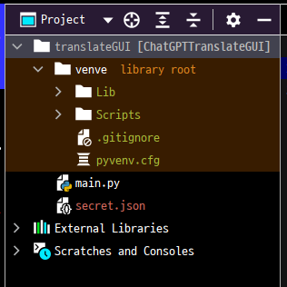

ChatGPT Translate GUI
===================

해당 프로그램은 OpenAI에서 제공하는 GPT-3.5 API를
python을 통해 연동한 PyQt5 GUI 프로그램입니다.

프로젝트 배경
--------

최근 OpenAI사에서 제공하는 다양한 AI 모델들에 대해 관심이 있었고 이를 API의 형태로 활용하기 위해 Spring boot를 통한 웹 서비스 프로젝트를 해본 경험이 있다.

하지만 OpenAI에서 제공하는 공식 기술 문서와 인터넷 상의 많은 자료들에서는 python언어를 사용한 레퍼런스들이 대부분이었고 JAVA를 사용하는 Spring boot에서는 전용으로 만들어진 의존성을 주입하거나 보다 복잡한 과정을 거쳐야만 했다.

따라서 이번 프로젝트에서는 python을 활용해 보다 쉽고 간편하게 API를 연동해보고 이를 활용한 프로그램을 PyQt5를 통해 GUI로 제작해보는 것이 목표였다. 


기능
-----

해당 프로그램에서는 GPT-3.5에서 지원하는 언어인
영어, 일본어, 중국어, 한국어, 스페인어, 프랑스어, 독일어, 이탈리아어, 포르투갈어, 네덜란드어, 러시아어의
입력과 번역을 지원한다.

또한 해당 프로그램의 선택 항목에는 포함되어있지 않으나
사어<sup>[1](#footnote_1)</sup> 하오체와 같은 고어투, 암호문이나
모스 부호 까지 해석이 가능하다.

해당 기능을 추가하기 위해서는
코드 내 작성된 언어 리스트에 원하는 항목을 추가하기만 하면 된다.


구조 설명
----


해당 프로그램은 PyQt5를 통해 작성된 GUI 프로그램이다.

따라서 PyQt5 모듈과 함께 openAI 기능을 활용하기 위한 openai,
GUI 프로그램 실행을 위한 sys, JSON 파일에 대한 관리를 위한 json 모듈을
사용하고 있다.


GUI의 구조의 경우 언어 리스트 중 원하는 언어로 번역되도록 선택하는 QComboBox,
번역을 원하는 텍스트를 입력받는 QTextEdit, 번역 기능을 실행하는 QPushButton,
번역 결과물을 출력하는 QTextBrowser로 구성되어있다.


위의 함수들 중에서 가장 중요한 부분은 번역 기능을 실행하는 함수인 btn_1_clicked 함수였다.

해당 함수가 실행되면 ComboBox와 TextEdit에서 입력된 값을 받아와 OpenAI로 보낼 지시어인 prompt를 생성한다.

이후 분리되어 저장된 API Key 값을 받아 온 뒤 openai의 text-davinci-003 모델에 prompt를 보내 원하는 결과값을 response에 받아온다.

이후 response에 담긴 번역 결과를 TextBrowser 항목에 출력하면 되는데
response는 문자열이 아닌 JSON의 형태이기 때문에 원하는 항목을 추출하고

추출한 문자열의 경우 문장의 맨 앞에 '\n\n'가 붙어있기 때문에 lstrip()을 통해 보기 좋게 수정하여 출력 값으로 보내준다.


시연 영상
---------

영상 링크: [https://www.youtube.com/watch?v=Q7jevApOwJQ](https://www.youtube.com/watch?v=Q7jevApOwJQ)


시연 영상에서 출력된 러시아어 번역문을
NAVER의 상용 번역 서비스인 Papago에서 입력해본 결과
번역이 정상적으로 이루어졌음을 알 수 있다.

참고 사항
----

위의 btn_1_clicked 함수를 보면 openai를 사용하기 위한 api key값을 불러올 때
secret.json에서 'apikey'값을 받아오고 있다.




이는 개인의 API KEY 값을 공유하기는 어렵기 때문에 위해 코드가 작성된 main.py 파일에 작성하지 않고
secret.json 파일을 따로 작성한 후 GitHub에는 업로드 하지 않았기 때문이다.

따라서 해당 GitHub를 clone하여 사용하고자 한다면 사용자가 main.py와
같은 디렉토리 내에 secret.json 파일을 스스로 작성해야한다.

secret.json 파일의 양식은 아래와 같다.

```json
{
  "apikey":"여기에 API KEY 값 입력"
}
```


<a name="footnote_1">1</a>: 과거에는 쓰였으나 현재는 사용되지 않는 말 ex) 고대 중국어, 라틴어, 산스크리트어